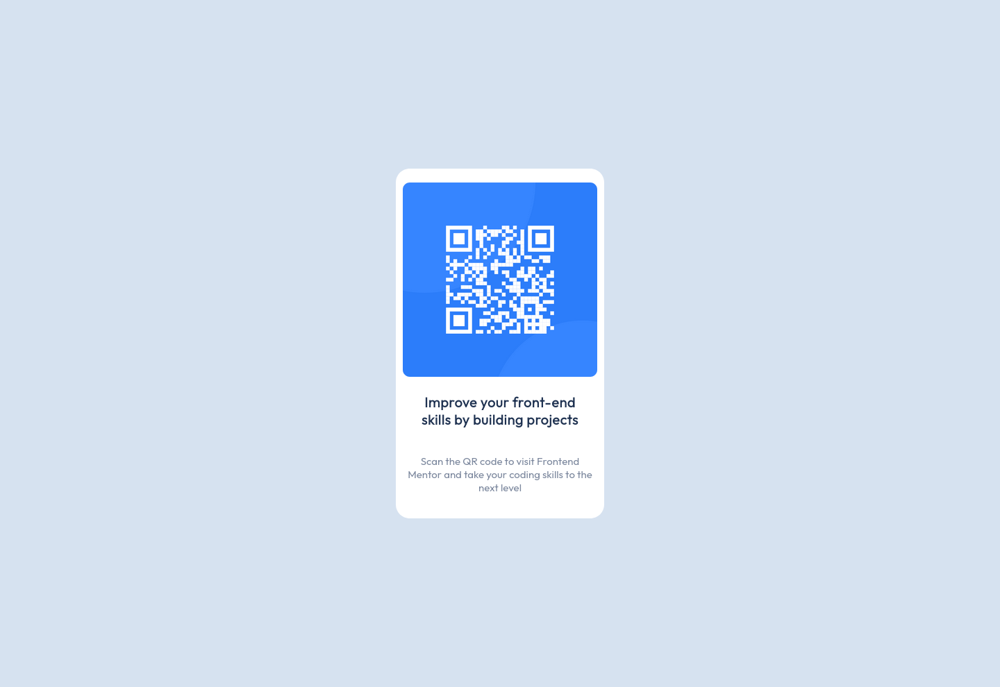

# Frontend Mentor - QR code component solution

This is a solution to the [QR code component challenge on Frontend Mentor](https://www.frontendmentor.io/challenges/qr-code-component-iux_sIO_H). Frontend Mentor challenges help you improve your coding skills by building realistic projects. 

## Table of contents

- [Overview](#overview)
  - [Screenshot](#screenshot)
  - [Links](#links)
- [My process](#my-process)
  - [Built with](#built-with)
  - [What I learned](#what-i-learned)
  - [Continued development](#continued-development)
  - [Useful resources](#useful-resources)
- [Author](#author)
- [Acknowledgments](#acknowledgments)

**Note: Delete this note and update the table of contents based on what sections you keep.**

## Overview

### Screenshot




### Links

- Solution URL: [My GitHub Repository](https://github.com/testpilotuk/my-frontend-mentor)
- Live Site URL: [My Live Site](https://chrisinportugal.com/frontend-mentor/qr-code.html)

## My process

### Built with

- Semantic HTML5 markup
- CSS custom properties
- Flexbox


### What I learned
I learned that centering things can be a headache but that Flexbox can make things a lot easier. For the html I implemented 2 divs with the 2nd containing an unordered list with the image, heading and paragraph elements. 
``` html
<div class="qr-background">
            <div id="container">
                <ul class="qr-code-items">
                    <li></li>
                    <li><h1 class="qr-text">Improve your front-end skills by building projects</h1></li>
                    <li><p class="qr-text">Scan the QR code to visit Frontend Mentor and take your coding skills to the next level</p></li>
                </ul>
            </div> 
        </div>
```

I used Flexbox to both center the elements on the page  and to center the design elements (text and image). The outer div:
```
.qr-background {
    max-width: 1440px;
    height: 100vh;
    margin: auto;
    display: flex;
    justify-content: space-around;
    background-color: var(--light-gray);
}

```

and the inner div contains the image and text:
```
.qr-code-items {
    display: flex;
    flex-direction: column;
    align-items: center;
    gap: 1em;
    margin-left: auto;
    margin-right: auto;
    padding: 1em;
}

```

### Continued development

- I could have possibly made this easier by using CSS Grid but as a beginner I still do not feel confident with Grid yet. I will therefore need to study more. 
- The most difficult aspect of this challenge was guessing the widths used in the design.
- The area I spent the most time on was getting the white space right around the text elements and I still feel that I kind of shoe horned them in there and there must be a much more elegant solution.

## Author

- Website - [Chris Sutcliffe](https://chrisinportugal.com/)
- Frontend Mentor - [@testpilotuk](https://www.frontendmentor.io/profile/testpilotuk)

